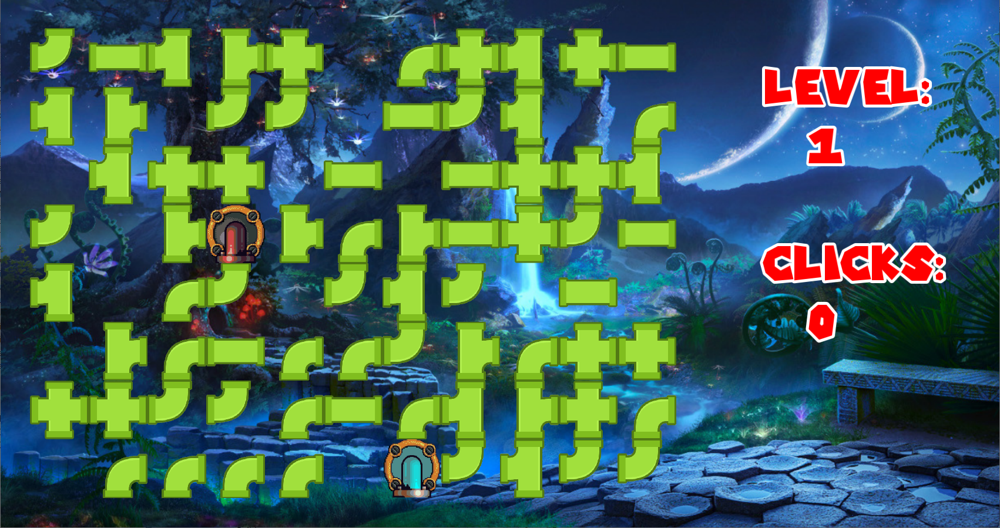

# Pipe-Puzzle-sfml
**Authors:** Daniecl cohen & David mamman
# Screenshot Game

<table align="center">
      
  <tr>
    <td>
	  
    </td>
    <td>
	  
    </td>
  </tr>
    <tr>
    <td>
	  
    </td>
	<td>
	  
    </td>
  </tr>
</table>

